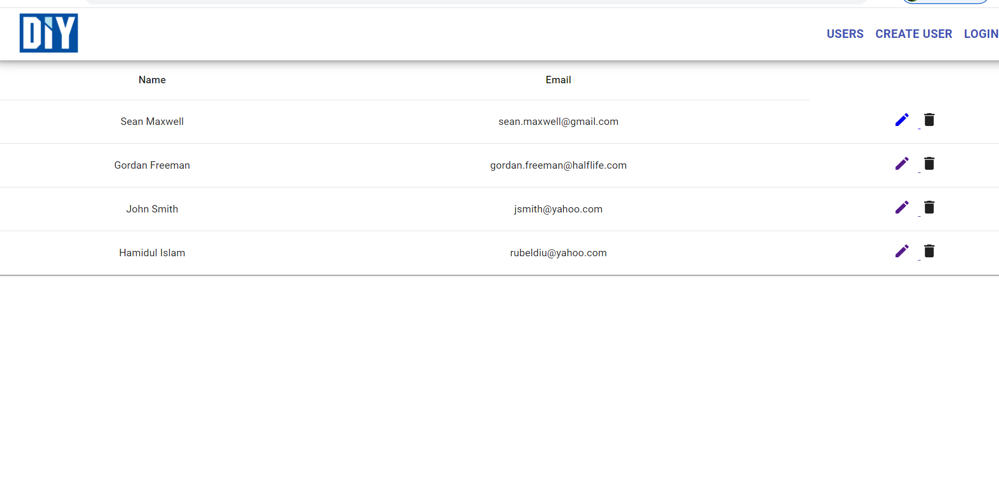

# Simple Client-Server-Temple

Project Overview: After authentication user can perform CRUD Operations.

## Start Server

In the project directory, you can run:

### `npm run start:dev`

## Start Client

In the project directory, you can go to src/client-react:

### `npm start`

<h2>Project screenshot</h2>

 

